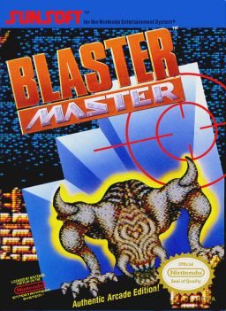

# MasterBlaster

A concurrent AWS account processor

## Prerequisites

You need to have Golang installed because you'll need to build it.

* Downloading information [here](https://golang.org/dl/).
* Learn generally about Golang [here](https://golang.org/).

You also need to install the AWS Golang SDK.  Do this:

`go get -u github.com/aws/aws-sdk-go`

## Building the MasterBlaster

It has a Makefile so from within the repository root directory, do:

`make`

## Using MasterBlaster

To use the MasterBlaster, you will need to bring it into your GO workspace.  Use the following command to install it:

`go get -u github.com/thomaswhitcomb/masterblaster.git`

## An Example

Look at `main.go`.  It is a hello world type example.  Very simple but demonstrates how to functionally use masterblaster.  In particular, take a look at the ResultPipe.  There is a Put and Get method for it.  Its purpose is to funnel results from the concurrent workers to a single goroutine which can safely handle/save the results in a non-concurrent environment.

You can run `main.go` using something like below.  Of course, specify your own account number and MFA for the control plane account.

`echo "275845523064" | ./bin/masterblaster -workers 20 -profile pcco -userid twhitcomb -mfa 319417`

# masterblaster
